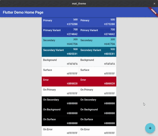

# Shape theme switcher

Provides the ShapeThemeSwitcher widget, which takes an theme, an alignment and
an shape, and once the theme changes, it builds the child with the new theme,
takes the image of the current child, and displays the new theme under the old,
while clipping the old to the shape, growing until it fills the screen and only
the new child is visible.

## DEMO

